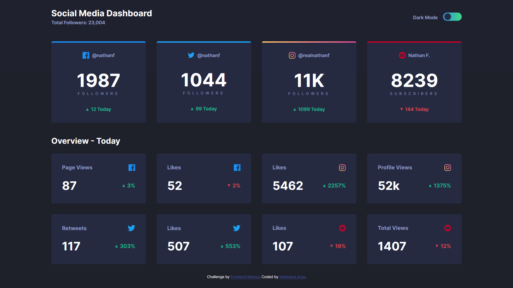
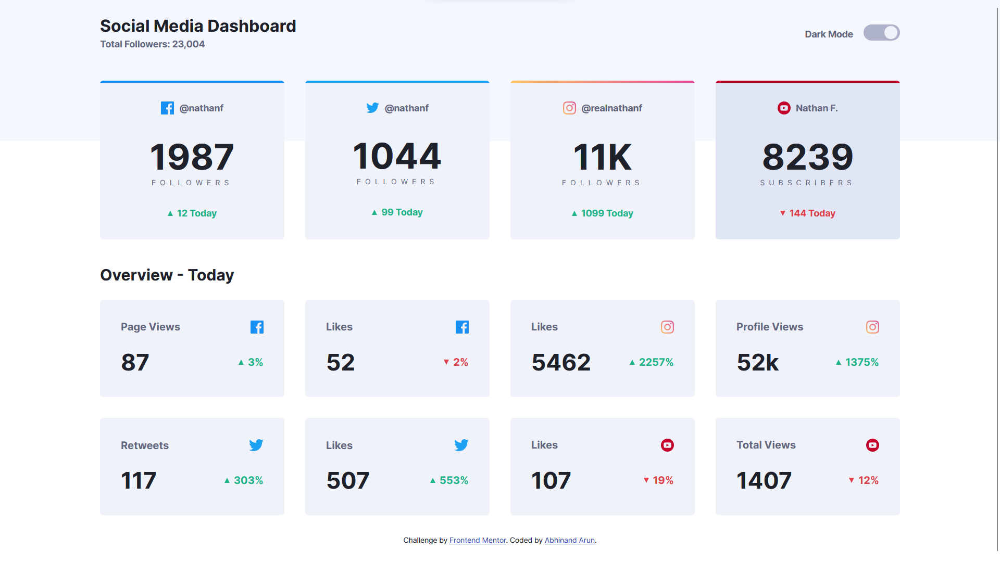

# Frontend Mentor - Social media dashboard with theme switcher solution

This is a solution to the [Social media dashboard with theme switcher challenge on Frontend Mentor](https://www.frontendmentor.io/challenges/social-media-dashboard-with-theme-switcher-6oY8ozp_H). Frontend Mentor challenges help you improve your coding skills by building realistic projects. 

## Table of contents

- [The challenge](#the-challenge)
- [Screenshot](#screenshot)
- [Built with](#built-with)
- [Links](#links)

## The challenge

Users should be able to:

- View the optimal layout depending on their device's screen size
- See hover states for interactive elements
- Toggle color theme to their preference

## Screenshot

## Built with

- Semantic HTML5 markup
- CSS custom properties
- Sass
- Flexbox
- Grid

## Links

- Solution URL: [https://www.frontendmentor.io/solutions/social-media-dashboard-using-sass-flexbox-and-grid-tw8sgLjhVl](https://www.frontendmentor.io/solutions/social-media-dashboard-using-sass-flexbox-and-grid-tw8sgLjhVl)
- Live Site URL: [https://abhinandarun-02.github.io/social-media-dashboard-with-theme-switcher/](https://abhinandarun-02.github.io/social-media-dashboard-with-theme-switcher/)